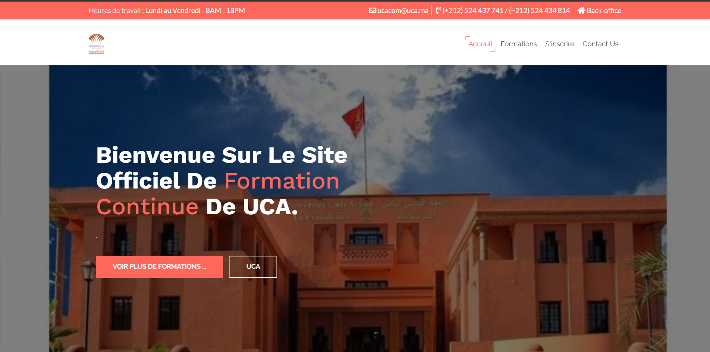

# Formation-continue-uca
# Idée général 
Cette application est la remplaçante de l'application Formation Continue de l'université CADI AYYAD. (http://formationcontinue.uca.ma/)
## LES DIFFERENTS ACTEURS DE L'APPLICATION ET LEURS FONCTIONNALITES
### Admin (l'administrateur de l'application) :
-	La gestion des interfaces qui s'affichent aux visiteurs (Front-End: annonces, contactez-nous, contenue header, contenue footer).
-	La gestion des employés (les responsables de filières).
-	La gestion des filières (avec établissement).
-	Gestion des plaquettes de filière.
-	Gestion des demandes d'admission pour toutes les filières.
-	Réglages général de l'application.
-	Gérer ses propres informations (super admin connectés).

### Résponsable de filiére :
-	Visualisation de la plaquette de sa filière.
-	Gestion des demandes d'admission pour la filière dont l'utilisateur est responsable.
-	Gérer ses propres informations (l'utilisateur connectés)
-	Visualisation des autres filières.

### Visiteurs : 
-	Une page d'accueil 

-	Une page qui expose toutes les formations dans la base de données avec leurs plaquettes (PDF)

-	Une page qui permet au différent visiteurs d'envoyer des mails.
-	Le formulaire qui permet aux visiteurs de remplir le formulaire de demande d'admission dans la filière voulue.

# Initialisation et configuration de l'application

- Cloner le projet :
Git clone https://github.com/FaissalElfid/Formation-continue-uca.git

- Importer la base de données:
Importer la base de données formation_v3.sql : https://github.com/FaissalElfid/Formation-continue-uca/blob/main/formations_v3.sql
Modifier la configuration de la base de données dans /application/config/database.php 

- S'authentifier
`Admin :
Nom d'utilisateur: faissal.elfid@gmail.com
Mot de passe : faissal` 

`Exemple responsable de filière : 
Nom d'utilisateur : faissal
Mot de passe : faissal`

# Structure du projet

